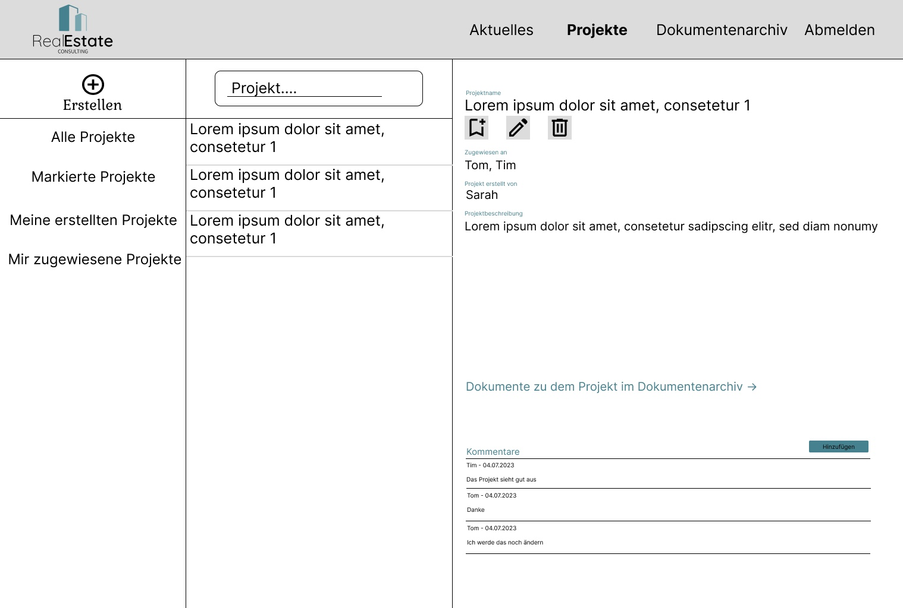
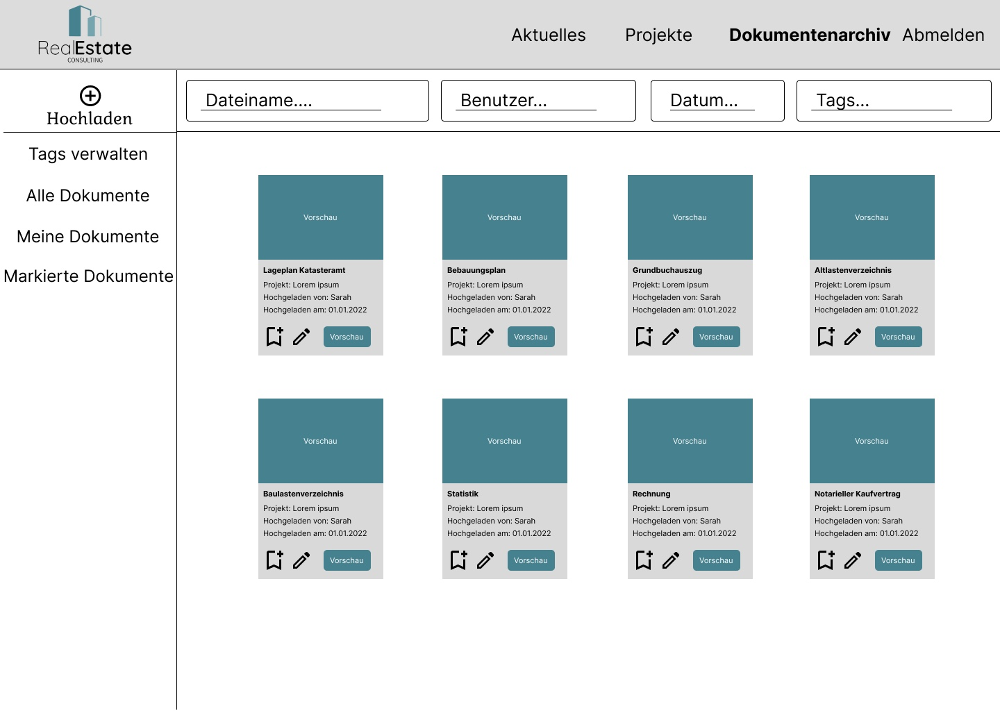
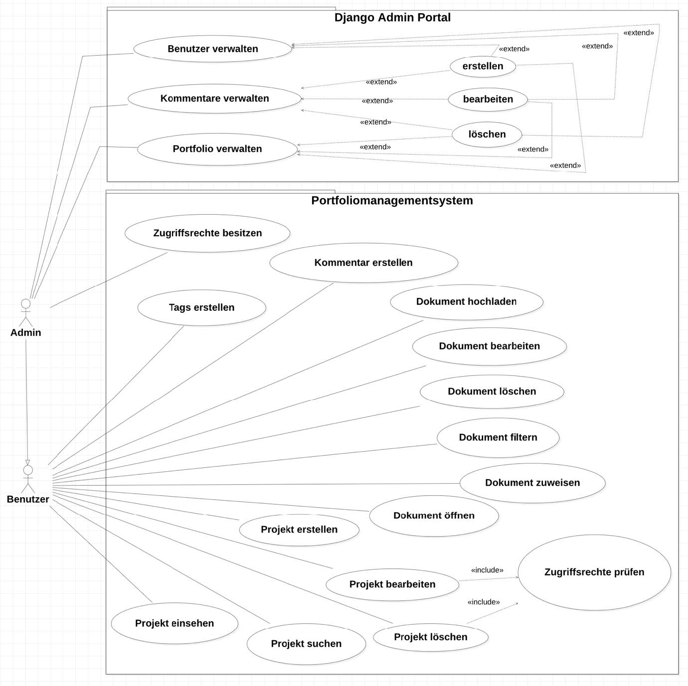
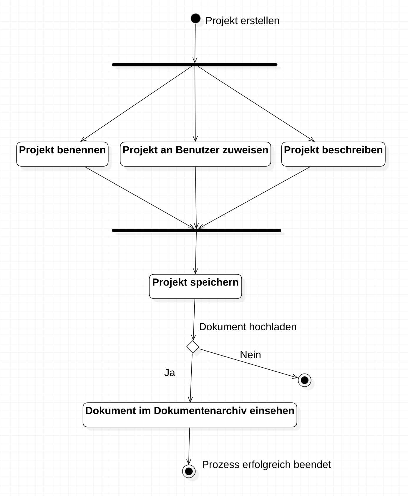
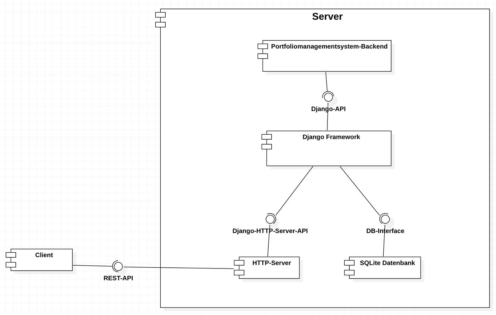
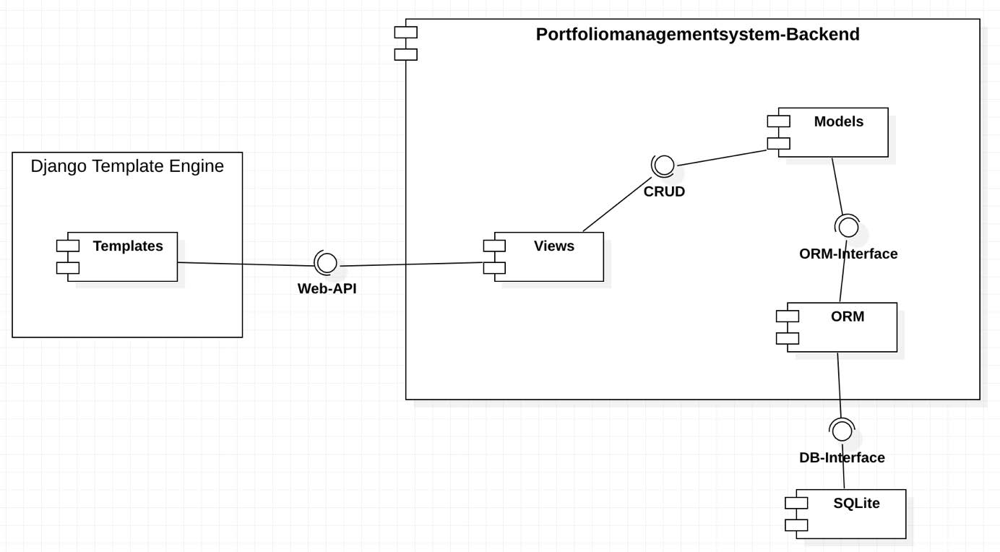
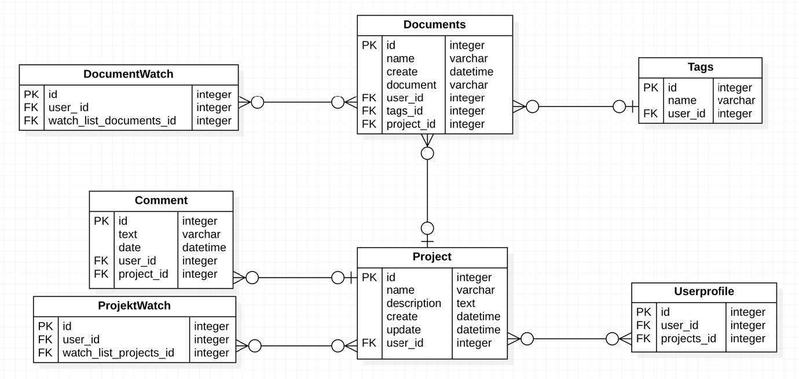
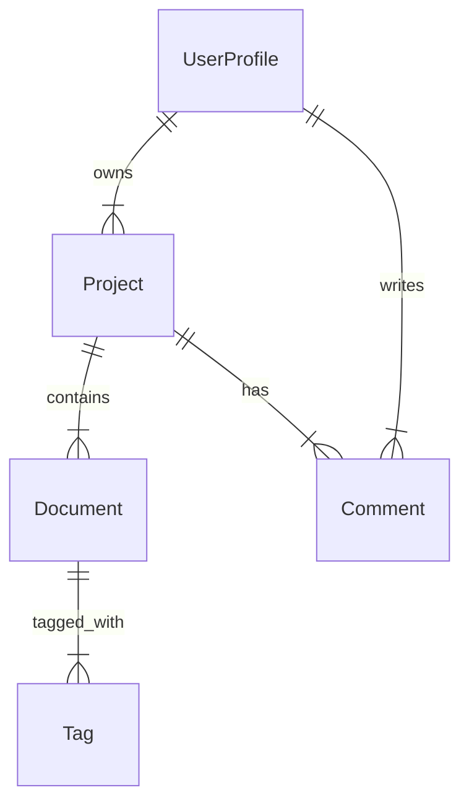

# Portfoliomanagement-Software für die Immobilienbranche

---

## Projektbeschreibung

Diese Portfoliomanagement-Software wurde speziell für die **Immobilienbranche** entwickelt, um eine effizientere Verwaltung von **Projekten und Dokumenten** zu ermöglichen. Die Software bietet Funktionen wie:

- **Digitale Verwaltung von Immobilienprojekten**
- **Zuweisung von Projekten an Mitarbeiter**
- **Dokumentenarchiv mit Such- und Filterfunktionen**
- **Kommentare zur besseren internen Kommunikation**
- **Zugriffsrechte basierend auf Rollen**

Die Software basiert auf einem **Django-Backend** und nutzt **SQLite** für die Datenverwaltung. Das Frontend wurde mit **HTML, CSS, JavaScript** und **Bootstrap** umgesetzt.

---

## Screenshots & Diagramme

### **Landing Page**


### **Projektverwaltung**


### **Dokumentenarchiv**


### **Use Case Diagramm**


### **Aktivitätsdiagramm**


### **Architekturentwurf**


### **Softwareentwurf Backend**


### **Datenbankentwurf**


---

## Tech-Stack

- **Backend:** Django (Python), SQLite
- **Frontend:** HTML, CSS, JavaScript, Bootstrap
- **Libraries:** jQuery, Moment.js, Dropzone.js, Select2
- **API:** REST-API zur Kommunikation zwischen Frontend und Backend

---

## Installation & Setup

1️⃣ **Repository klonen:**
```bash
git clone https://github.com/dein-user/dein-repo.git
cd dein-repo
```

2️⃣ **Virtuelle Umgebung erstellen & aktivieren:**
```bash
python -m venv venv
source venv/bin/activate  # macOS/Linux
venv\Scripts\activate      # Windows
```

3️⃣ **Abhängigkeiten installieren:**
```bash
pip install -r requirements.txt
```

4️⃣ **Datenbankmigration ausführen:**
```bash
python manage.py migrate
```

5️⃣ **Superuser erstellen (Admin-Zugang):**
```bash
python manage.py createsuperuser
```

6️⃣ **Server starten:**
```bash
python manage.py runserver
```
Die Anwendung ist nun unter **http://127.0.0.1:8000/** erreichbar. 🎉

---

## Features & Funktionen

**Projektverwaltung**  
- Projekte erstellen, bearbeiten & löschen  
- Zuweisung von Projekten an Mitarbeiter  
- Verwaltung von Zugriffsrechten  

**Dokumentenarchiv**  
- Hochladen & Bearbeiten von Dokumenten  
- Tags & Suchfunktionen  
- Vorschau der Dokumente  

**Benutzer- & Rollenmanagement**  
- Admin-Dashboard mit Benutzerverwaltung  
- Rollenbasierte Zugriffssteuerung  

**Interne Kommunikation**  
- Kommentarfunktion für jedes Projekt  
- Realtime-Aktualisierungen  

---

## Datenbankstruktur

Ein Überblick über die **Datenbanktabellen**:



---

## Weiterentwicklung

Geplante zukünftige Funktionen:
- **Benachrichtigungssystem für Projektupdates**
- **Detaillierte Analyse und Dashboard für KPIs**
- **Mobile-freundliche Version**
- **Integration mit externen Systemen (z. B. Google Drive, Dropbox)**
